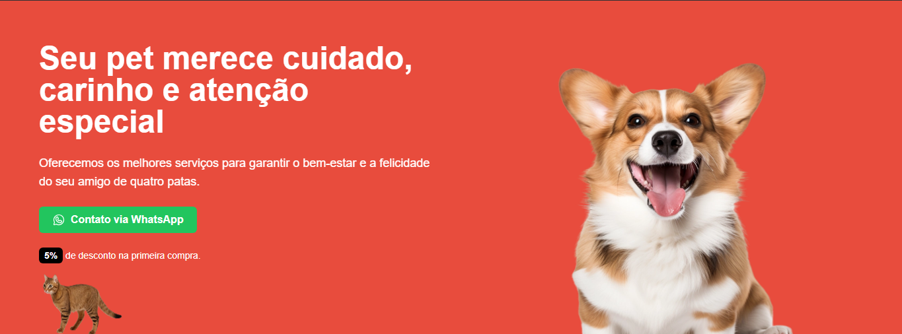
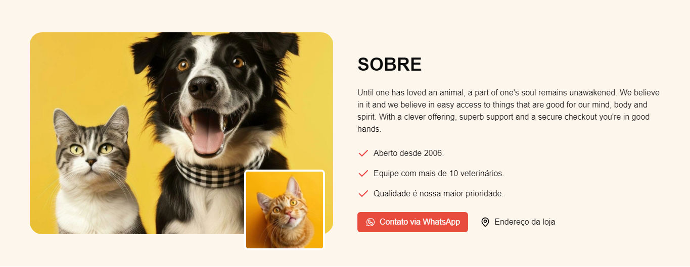
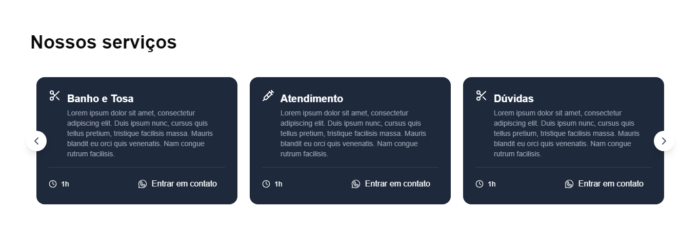
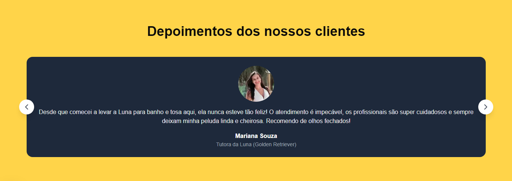
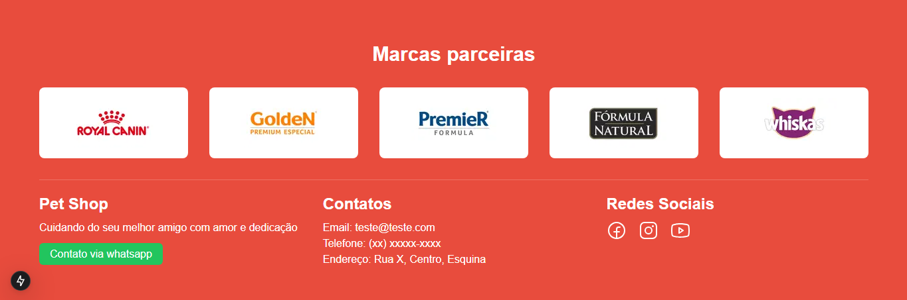

# Landing Page - Petshop

## 📌 Descrição
Landing page desenvolvida para um petshop, destacando serviços, depoimentos e chamada para ação.

## 🚀 Tecnologias Utilizadas
- [Next.js](https://nextjs.org/) - Framework React para aplicações web
- [Tailwind CSS](https://tailwindcss.com/) - Biblioteca para estilização rápida e eficiente
- [AOS (Animate On Scroll)](https://michalsnik.github.io/aos/) - Biblioteca para animações ao rolar a página

## 📂 Como Rodar o Projeto

1. Clone o repositório:
   ```bash
   git clone https://github.com/seu-usuario/nome-do-repositorio.git
   ```
2. Acesse o diretório do projeto:
   ```bash
   cd nome-do-repositorio
   ```
3. Instale as dependências:
   ```bash
   npm install
   # ou
   yarn install
   ```
4. Inicie o servidor de desenvolvimento:
   ```bash
   npm run dev
   # ou
   yarn dev
   ```
5. Acesse no navegador: `http://localhost:3000`

## 📸 Preview







## 📄 Licença
Este projeto está sob a licença MIT. Sinta-se à vontade para utilizá-lo e modificá-lo.

---
Criado por [Eduardo](https://github.com/Eduardozsw), considere também acessar meu [linkedin](https://www.linkedin.com/in/carloseduardossm/) 🐾

